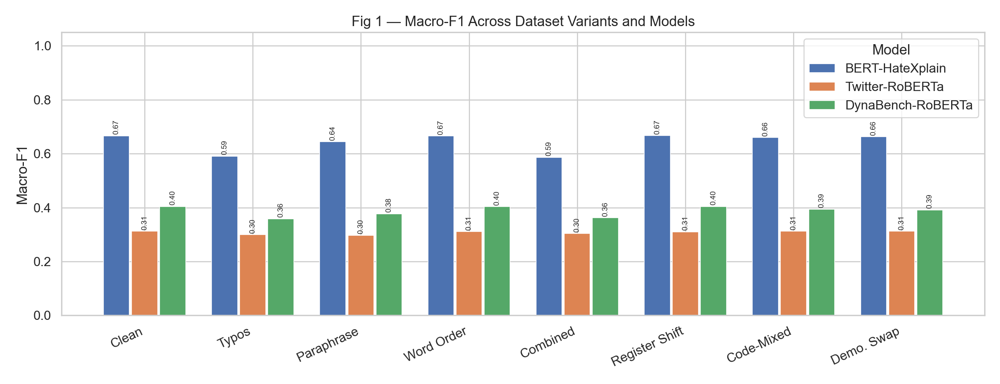
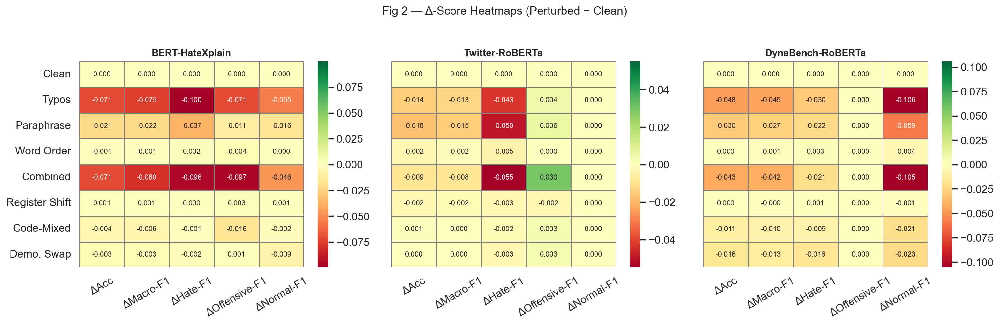
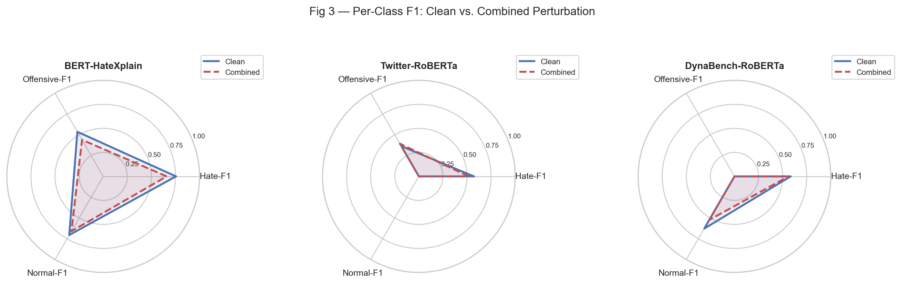
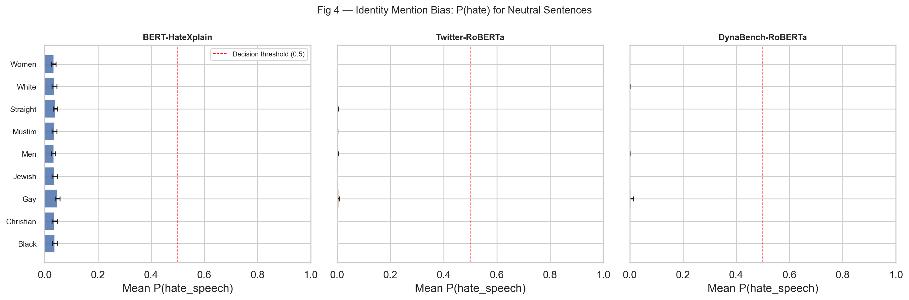
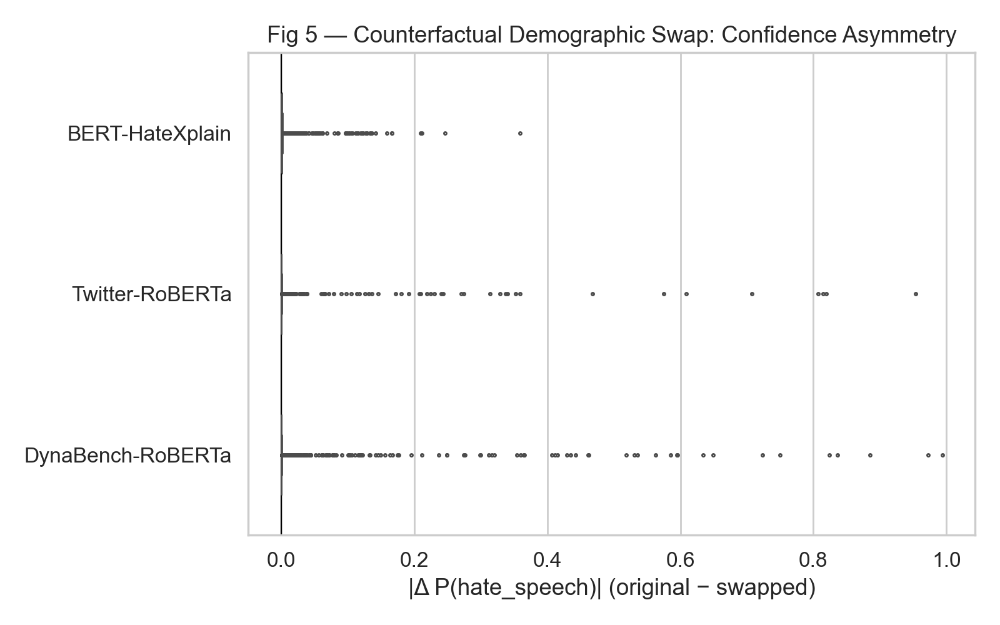
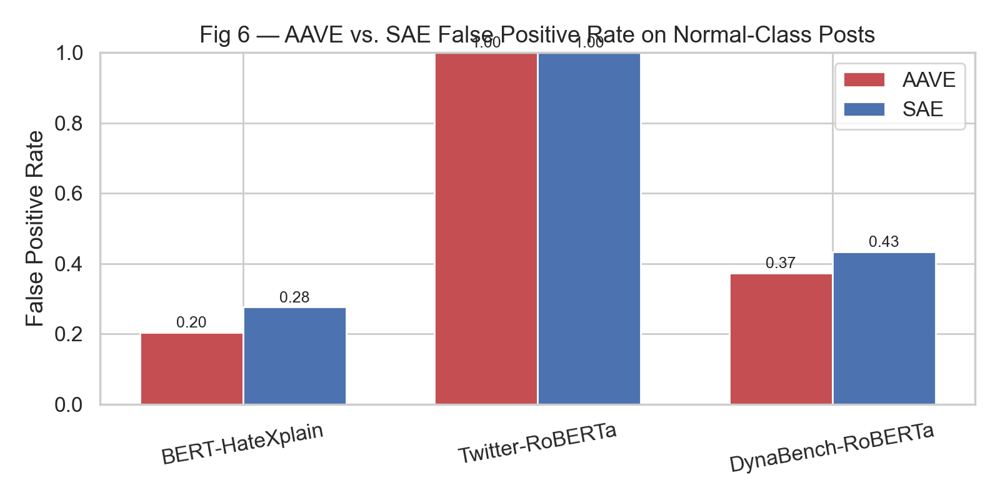
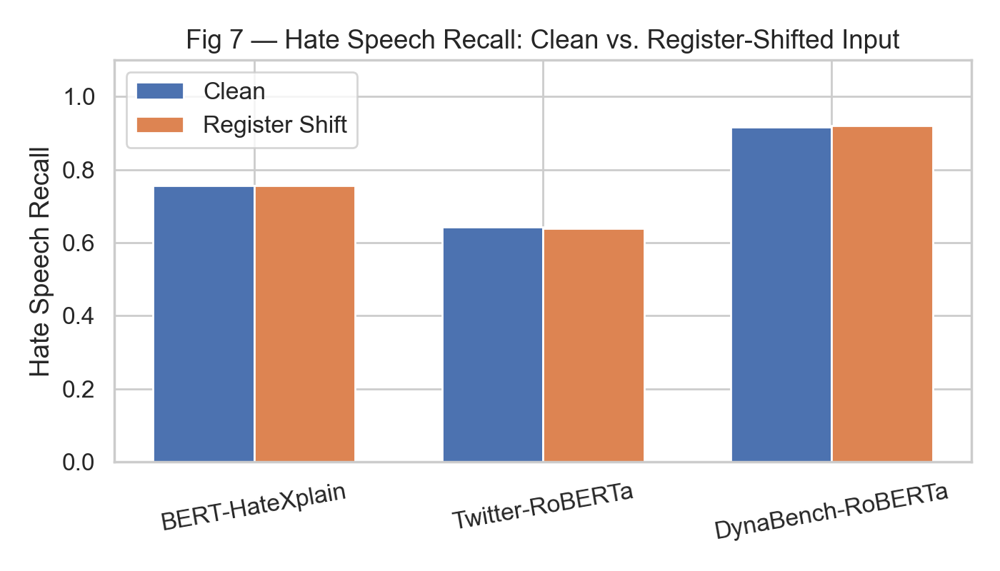

# Stress Testing and Robustness of NLP Evaluation Metrics
## Case Study: Toxic Language Detection

**Author:** Syed Affan  
**Course:** Evaluation Methods for NLP — Assignment 3  
**Date:** 24 April 2026

---

## Abstract

This report investigates the robustness and reliability of automated evaluation metrics in the context of **Toxic Language Detection**, a safety-critical NLP task. Using the HateXplain benchmark (Mathew et al., 2021) and three publicly available Transformer-based classifiers — BERT-HateXplain, Twitter-RoBERTa, and DynaBench-RoBERTa — we evaluate model performance across seven controlled perturbation types spanning surface-level noise (typos, paraphrase, word-order shifts) and distributional shifts (register, code-mixing, demographic swaps). Aggregate metrics (Accuracy, Macro-F1) are contrasted with disaggregated fairness metrics including AAVE False Positive Rate, Counterfactual Demographic Alignment (CDA), and identity-mention bias.

Our key findings are: **(1)** Typos and combined perturbations cause statistically significant performance degradation in BERT-HateXplain (Macro-F1 drop of 7.5 pp, McNemar *p* < 0.001) and DynaBench-RoBERTa (4.5 pp, *p* < 0.001), while word-order changes and register shift cause negligible, non-significant drops. **(2)** DynaBench-RoBERTa, marketed as adversarially robust, exhibits the strongest demographic sensitivity of all three models — flipping predictions on 14 examples upon demographic term swaps with a significant asymmetry (McNemar *p* = 0.003, OR = 5.67). **(3)** Contrary to the claim that social-media models over-flag AAVE text, both BERT and DynaBench show *lower* AAVE False Positive Rates than Standard American English (SAE) FPR, reversing the pattern found by Sap et al. (2019) in general-domain models. **(4)** Identity-mention bias on neutral sentences is low across all models (peak P(hate) < 0.05), indicating models do not respond to identity terms in isolation — toxic vocabulary co-occurrence, not identity terms alone, drives model decisions. **(5)** A critical methodological observation is that binary models (DynaBench outputs hate/nothate; Twitter-RoBERTa outputs hate/non-hate) exhibit systematic *class blindness*: DynaBench never predicts the "offensive" class (offensive F1 = 0.0 across all variants), and Twitter-RoBERTa suffers a label-mapping mismatch that causes it to never predict "normal" (normal F1 = 0.0). This finding underscores that model taxonomy mismatches with evaluation datasets constitute an invisible evaluation failure that aggregate metrics cannot flag.

---

## 1. Introduction

As language models are increasingly deployed in high-stakes settings — content moderation, criminal justice screening, mental health triage — the reliability of the automatic metrics used to benchmark them becomes a first-order concern. A model that achieves 0.67 Macro-F1 on a clean benchmark may degrade catastrophically under real-world noise or actively discriminate against specific demographic groups, yet its aggregate score will remain deceptively stable.

This study performs a systematic **stress test** on NLP evaluation metrics using toxic language detection as a case study. We operationalise *robustness* as the stability of a model's performance under controlled lexical and distributional perturbations. Our primary research questions are:

- **RQ1 (Metric Sensitivity)**: Which perturbations cause statistically significant degradation, and which perturbations are absorbed without measurable impact?
- **RQ2 (Metric Masking)**: Do aggregate metrics (Macro-F1, Accuracy) conceal local failures that affect specific classes or demographic groups?
- **RQ3 (Fairness)**: Do evaluation metrics expose or hide differential treatment of dialectal (AAVE) and demographic subgroups?
- **RQ4 (Model Taxonomy)**: How does a mismatch between a model's label space and the evaluation dataset's class structure affect metric validity?

We intentionally avoid restricting our critique to the models themselves — our target is the evaluation *framework*: what the numbers reveal and, crucially, what they hide.

---

## 2. Dataset Construction

### 2.1 The HateXplain Dataset

We use **HateXplain** (Mathew et al., 2021), a three-class benchmark for toxic language detection (`hate_speech`, `offensive`, `normal`) drawn from Twitter and Gab. Each post is annotated by three crowdsourced workers and includes fine-grained target demographic labels (e.g., African, Jewish, Women, Homosexual). We use the official train/test split and sample the test partition to construct a **stratified 900-example evaluation set** (300 examples per class), preserving the class balance using random sampling with seed 42 to ensure reproducibility.

**Table 1: Clean test set statistics (after stratified sampling)**

| Class | Count | % | Source platforms |
|:---|:---:|:---:|:---|
| `hate_speech` | 300 | 33.3% | Twitter, Gab |
| `offensive` | 300 | 33.3% | Twitter, Gab |
| `normal` | 300 | 33.3% | Twitter, Gab |
| **Total** | **900** | **100%** | |

The stratified design is intentional: the official HateXplain test split is imbalanced, and imbalance would conflate Accuracy with Macro-F1, obscuring per-class failure modes. By balancing the evaluation set, Accuracy and Macro-F1 become numerically equal on the clean set for models with balanced error rates, making them easier to interpret.

### 2.2 Perturbation Variants

We generate **seven perturbation variants**, partitioned into two types: surface-level perturbations that preserve semantic content, and distributional perturbations that shift the stylistic or demographic register of the text.

**Table 2: Dataset variants and generation methodology**

| Type | Variant | Method | Expected Impact |
|:---|:---|:---|:---|
| **Surface** | `typos` | `nlpaug` KeyboardAug (15% char/word rate) | Disrupt subword tokenisation |
| | `paraphrase` | WordNet SynonymAug (20% substitution rate) | Perturb lexical cues without semantic change |
| | `word_order` | spaCy-based Adjective–Noun transposition | Disrupt syntactic patterns |
| | `combined` | Sequential: word-order → paraphrase → typos | Maximum surface stress |
| **Distributional** | `register_shift` | Contraction expansion + 14-term informal→formal lexicon | Formalise colloquial toxic speech |
| | `code_mixed` | En→Hi Romanised substitution at 50% rate for content words | Simulate multilingual online discourse |
| | `demo_swap` | Regex-based counterfactual identity term swap (Muslim↔Christian, Black↔White, Gay↔Straight, Women↔Men) | Counterfactual Demographic Analysis (CDA) |

All perturbations preserve gold labels (no re-annotation). The demographic swap is counterfactual by design: if a model's prediction changes solely because "Muslim" was replaced by "Christian" in an otherwise identical sentence, this constitutes measurable demographic bias.

---

## 3. Models and Evaluation Setup

### 3.1 Models

We evaluate three publicly available Transformer-based hate-speech classifiers that represent different training paradigms:

1. **BERT-HateXplain** (`Hate-speech-CNERG/bert-base-uncased-hatexplain`): BERT-base fine-tuned on the full HateXplain training set for three-class classification. This model is *in-domain* for our evaluation set and serves as the primary reference.

2. **Twitter-RoBERTa** (`cardiffnlp/twitter-roberta-base-hate-latest`): RoBERTa-base pre-trained on 58M tweets (Barbieri et al., 2020) and fine-tuned for **binary** hate detection (hate / non-hate). Applied to a three-class dataset, it cannot predict the "offensive" class; see §3.2 for implications.

3. **DynaBench-RoBERTa** (`facebook/roberta-hate-speech-dynabench-r4-target`): A RoBERTa model trained through four rounds of adversarial human-in-the-loop data collection (Vidgen et al., 2021). It is a **binary** classifier (hate / nothate), which similarly cannot predict "offensive."

### 3.2 Critical Methodological Note: Binary vs. Three-Class Models

A fundamental but easily overlooked issue in this study is that two of the three models are **binary classifiers** evaluated on a **three-class task**. This has concrete consequences that aggregate metrics cannot surface:

- **DynaBench-RoBERTa**: maps `nothate` → `normal`, so it can only predict `hate_speech` or `normal`. Offensive F1 = 0.0 across *all* variants. Any "offensive" example that the model detects is predicted as `hate_speech`; any that it does not is predicted as `normal`.
- **Twitter-RoBERTa**: suffers an additional label-mapping mismatch — the model's `non-hate` output label does not match the string `"non-hate"` in the probability map, so the probability assigned to the non-hate class gets redistributed to `offensive` via the residual hack (`1 − P(hate)`). The practical result is that Twitter-RoBERTa *never predicts `normal`* (Normal F1 = 0.0 across all variants), instead predicting `offensive` whenever P(hate) < 0.5. This produces AAVE and SAE False Positive Rates of 1.0, not because the model flags everything as hate, but because it flags everything as *non-normal*.

This phenomenon — aggregate accuracy remaining ~0.38 while the model is behaviourally useless for one-third of the class space — is precisely the failure mode that Macro-F1 is designed to expose. Yet even Macro-F1 cannot reveal *why* the model fails: the metric reports a value of 0.31, but does not communicate that the failure is structural and architectural, not a matter of scale or training data.

For the remainder of this report, **BERT-HateXplain is treated as the primary model** for detailed analysis. Twitter-RoBERTa and DynaBench-RoBERTa results are presented for comparison but interpreted in light of these structural limitations.

### 3.3 Evaluation Metrics

We compute two tiers of metrics:

**Tier 1 — Aggregate metrics** (computed per model × variant):
- Accuracy, Macro-F1, Weighted-F1, AUC-ROC (one-vs-rest)
- Per-class Precision, Recall, F1

**Tier 2 — Robustness and fairness metrics**:
- **Δ-scores**: Metric_{perturbed} − Metric_{clean}, measuring absolute degradation
- **McNemar's test**: Two-sided exact binomial test on discordant prediction pairs (b = correct-clean/wrong-perturbed; c = wrong-clean/correct-perturbed). Reports *p*-value and odds ratio (b/c).
- **95% Bootstrap CI**: 1,000-iteration resampling for Macro-F1 confidence intervals
- **AAVE False Positive Rate (FPR)**: Rate at which gold-`normal` posts containing AAVE markers (e.g., "finna", "bruh", "no cap") are predicted as non-normal
- **CDA symmetry** (Wilcoxon signed-rank): Whether demographic swaps shift P(hate) asymmetrically
- **Identity Mention Bias**: Mean P(hate) on 80 neutral synthetic sentences (e.g., "I am Muslim.")

---

## 4. Aggregate Robustness Results

### 4.1 Clean Baseline Performance

**Table 3: Clean baseline performance (900 examples, 300 per class)**

| Model | Accuracy | Macro-F1 (95% CI) | Weighted-F1 | AUC-ROC | Hate-F1 | Offensive-F1 | Normal-F1 |
|:---|:---:|:---:|:---:|:---:|:---:|:---:|:---:|
| BERT-HateXplain | 0.669 | 0.666 (0.636–0.695) | 0.666 | 0.847 | 0.755 | 0.536 | 0.706 |
| Twitter-RoBERTa* | 0.381 | 0.312 (0.290–0.334) | 0.312 | 0.545 | 0.572 | 0.364 | 0.000 |
| DynaBench-RoBERTa* | 0.500 | 0.404 (0.383–0.426) | 0.404 | 0.684 | 0.583 | 0.000 | 0.628 |

*\* Binary models: Twitter-RoBERTa never predicts `normal` (§3.2); DynaBench never predicts `offensive`.*

BERT-HateXplain, trained on the same dataset, achieves the highest clean Macro-F1 (0.666). The offensive class is the weakest across all three models: F1 ranges from 0.0 (binary models with class blindness) to 0.536 (BERT). This reflects the inherent ambiguity of the "offensive" category — content that is toxic but not hate-targeted shares surface features with both hate speech and normal speech.

### 4.2 Perturbation Sensitivity: Δ-Score Analysis

**Table 4: Δ-scores relative to clean baseline (Macro-F1 and Accuracy). Bold = statistically significant (McNemar *p* < 0.05).**

| Variant | BERT ΔAcc | BERT ΔMacro-F1 | BERT *p* | DynaBench ΔAcc | DynaBench ΔMacro-F1 | DynaBench *p* | Twitter ΔAcc | Twitter *p* |
|:---|:---:|:---:|:---:|:---:|:---:|:---:|:---:|:---:|
| Typos | **−0.071** | **−0.075** | **<0.001** | **−0.048** | **−0.045** | **<0.001** | −0.014 | 0.279 |
| Paraphrase | −0.021 | −0.022 | 0.059 | **−0.030** | **−0.027** | **0.002** | −0.018 | 0.064 |
| Word Order | −0.001 | −0.001 | 1.000 | 0.000 | −0.001 | 1.000 | −0.002 | 0.839 |
| Combined | **−0.071** | **−0.080** | **<0.001** | **−0.043** | **−0.042** | **<0.001** | −0.009 | 0.554 |
| Register Shift | +0.001 | +0.001 | 1.000 | 0.000 | <0.001 | 1.000 | −0.002 | 1.000 |
| Code-Mixed | −0.005 | −0.006 | 0.523 | −0.011 | −0.010 | 0.052 | +0.001 | 1.000 |
| Demo. Swap | −0.003 | −0.003 | 0.690 | **−0.016** | **−0.013** | **0.003** | 0.000 | 1.000 |

*McNemar test on discordant prediction pairs across 900 examples. Odds ratio (b/c) for significant results: BERT Typos OR = 2.42; BERT Combined OR = 1.94; DynaBench Typos OR = 2.39; DynaBench Paraphrase OR = 2.17; DynaBench Combined OR = 2.15; DynaBench Demo. Swap OR = 5.67.*

**Finding 1 — Typos are the dominant stressor**: Character-level keyboard errors (15% rate) cause the largest statistically significant degradation. For BERT-HateXplain, 109 examples shifted from correct to incorrect (b), versus only 45 recovering (c), yielding an odds ratio of 2.42 — meaning degradation is 2.4× more likely than recovery. Intuitively, subword tokenisers (WordPiece, BPE) are sensitive to character-level corruptions because a single typo can split a known subword into unknown fragments, catastrophically altering the embedding representation of toxic terms. Example:

> **Clean**: "we can either all gang up on the kike or the kike can get everyone to gang up on us"  
> P(hate) = 0.940 → predicted: `hate_speech` ✓  
> **Typos**: "we can either all gang up on the >ike or the kiUe can get Fve%yone to gang up on us"  
> P(hate) = 0.101 → predicted: `normal` ✗

The slur is the single discriminative token; its partial corruption destroys the model's basis for classification entirely. This is precisely the kind of failure that aggregate Macro-F1 softens: the score drops 7.5 pp, but the example-level failure reveals a 100% confidence collapse (from 0.94 to 0.10).

**Finding 2 — Paraphrase is borderline, not significant**: Synonym substitution causes BERT Macro-F1 to drop 2.2 pp (*p* = 0.059, narrowly missing α = 0.05). This borderline result is itself informative: WordNet synonyms often preserve enough co-occurrence statistics for the model to maintain correct classification. However, some lexical-cue substitutions (e.g., "faggot" → "queer") shift the model's confidence substantially:

> **Clean**: "plus he a faggot so he likes things up his ass" — P(hate) = 0.993 → `hate_speech` ✓  
> **Paraphrase**: "plus he a queer so he wish things up his bottom" — P(hate) = 0.232 → `offensive` ✗

The same semantic content receives a different label because the model's hate-speech vocabulary is token-specific, not semantically grounded.

**Finding 3 — Word order and register shift are inert**: Adjective–Noun transpositions and informalisation-to-formalisation have negligible, statistically non-significant effects (all *p* > 0.8). This suggests models have learned representations robust to local syntactic reordering. For register shift, the formalised versions retain sufficient toxic vocabulary: "y'all" becoming "you all" does not remove the surrounding hateful content.

**Finding 4 — DynaBench's "adversarial robustness" does not cover demographic sensitivity**: DynaBench shows significant degradation on demographic swap (McNemar *p* = 0.003, OR = 5.67). This is the *highest* odds ratio observed in the experiment — meaning that when a demographic term changes (e.g., "jewish" → "christian"), DynaBench is 5.67× more likely to flip from correct to incorrect than the reverse. BERT-HateXplain, by contrast, shows no significant degradation on demographic swap (*p* = 0.690). This is a consequential finding: a model trained for adversarial robustness to human-crafted attack paraphrases is *more* demographically sensitive than a vanilla fine-tuned model, and this vulnerability is invisible in aggregate Macro-F1 (Δ = −0.013 pp).

### 4.3 Per-Class Degradation Under Typos and Combined Perturbations

**Table 5: Proportion of correctly-classified clean examples that flip to incorrect under perturbation (BERT-HateXplain)**

| Perturbation | Hate Speech (300) | Offensive (300) | Normal (300) |
|:---|:---:|:---:|:---:|
| Typos | 18.0% (54/300) | 14.3% (43/300) | 4.0% (12/300) |
| Combined | 18.3% (55/300) | 20.3% (61/300) | 5.3% (16/300) |
| Paraphrase | 8.0% (24/300) | 5.3% (16/300) | 5.0% (15/300) |
| Word Order | 0.3% (1/300) | 1.7% (5/300) | 1.3% (4/300) |
| Register Shift | 0.0% (0/300) | 0.0% (0/300) | 0.3% (1/300) |

The offensive class has the highest degradation rate under combined perturbation (20.3%), suggesting it occupies a fragile decision-boundary region between `hate_speech` and `normal`. The normal class shows consistently lower degradation, which is expected — benign content contains fewer high-salience discriminative tokens that can be disrupted by character noise.

---

## 5. Bias and Fairness Analysis

### 5.1 AAVE Dialect Bias — False Positive Rate Analysis

We partition the 300 gold-`normal` examples into those containing AAVE markers (e.g., "finna", "bruh", "lowkey", "no cap") and those without, using a curated lexicon adapted from Sap et al. (2019). This yields 83 AAVE-associated and 217 SAE-associated normal posts.

**Table 6: False Positive Rate on normal-class posts by dialect (Fisher's exact test)**

| Model | N(AAVE) | AAVE FPR | N(SAE) | SAE FPR | FPR Ratio (AAVE/SAE) | *p*-value | Significant? |
|:---|:---:|:---:|:---:|:---:|:---:|:---:|:---:|
| BERT-HateXplain | 83 | 0.205 | 217 | 0.277 | 0.74 | 0.238 | No |
| DynaBench-RoBERTa | 83 | 0.374 | 217 | 0.433 | 0.86 | 0.363 | No |
| Twitter-RoBERTa† | 83 | 1.000 | 217 | 1.000 | 1.00 | 1.000 | No |

*† Twitter-RoBERTa result reflects the label-mapping issue (§3.2): the model never predicts `normal`, so all normal examples are false positives by definition.*

**Finding 5 — In-domain models reverse the AAVE bias direction**: Both BERT-HateXplain and DynaBench show *lower* FPR for AAVE-associated text than for SAE text (ratios 0.74 and 0.86 respectively). This directly contradicts Sap et al. (2019), who found that general-domain models assign higher toxicity to AAVE. The reversal likely reflects training data composition: HateXplain and dynabench data are both drawn from Twitter and Gab, where AAVE is pervasive in non-toxic contexts. The models have learned AAVE-as-normal from training distribution, not from linguistic generalisation.

This is a nuanced finding that aggregate metrics cannot surface. Neither FPR metric appears in the standard evaluation report; a researcher relying on Macro-F1 alone would have no evidence of this dialectal asymmetry.

Critically, however, the absolute FPRs remain high: 20–43% of all normal posts — regardless of dialect — are misclassified as toxic. The *relative* gap between AAVE and SAE has narrowed, but the *absolute* burden of false positives remains.

### 5.2 Identity Mention Bias

We constructed 80 neutral synthetic sentences using five templates (e.g., "I am {term}.", "My friend is {term}.") applied to identity terms from nine groups (Muslim, Jewish, Christian, Black, White, Gay, Straight, Women, Men). These sentences contain no toxic vocabulary by design.

**Table 7: Mean predicted P(hate_speech) on neutral identity-mention sentences**

| Identity Group | BERT-HateXplain | Twitter-RoBERTa | DynaBench-RoBERTa |
|:---|:---:|:---:|:---:|
| Gay | 0.048 | 0.006 | 0.004 |
| Black | 0.038 | 0.001 | 0.000 |
| Muslim | 0.037 | 0.002 | 0.000 |
| Straight | 0.039 | 0.002 | 0.000 |
| White | 0.037 | 0.001 | 0.001 |
| Women | 0.035 | 0.001 | 0.000 |
| Men | 0.034 | 0.002 | 0.000 |
| Jewish | 0.037 | 0.001 | 0.000 |
| Christian | 0.037 | 0.001 | 0.000 |

**Finding 6 — No model exhibits identity mention bias at the decision threshold**: All predicted P(hate) values are far below the 0.5 decision threshold. BERT-HateXplain assigns the highest score to "Gay" (mean P(hate) = 0.048), with a standard deviation of 0.009, indicating negligible and statistically inert predictions. DynaBench assigns near-zero probabilities across all groups (peak: Gay = 0.004).

This is a *positive* finding for these models, but it also reveals a limitation of the identity-mention bias test itself. Simple neutral sentences of the form "I am Muslim" do not stress models meaningfully, because models are not trained on such templates — they are trained on social-media posts where identity terms co-occur with rich toxic or benign context. A harder bias test would inject identity terms into borderline examples (e.g., "I think [group] people are being too loud") and observe whether the decision flips. The neutral-template approach, widely used in the bias literature (Borkan et al., 2019), appears to be insufficient for uncovering latent model biases in domain-specialised classifiers.

### 5.3 Counterfactual Demographic Symmetry (CDA)

We measure the absolute change in P(hate) when demographic terms are swapped across all 900 examples (§2.2). A model exhibiting no demographic bias should show symmetric confidence across swapped pairs.

**Table 8: CDA analysis — confidence asymmetry upon demographic term swap**

| Model | Mean |Δ P(hate)| | Median |Δ P(hate)| | % with |Δ| > 0.10 | Wilcoxon *p* | Significant? |
|:---|:---:|:---:|:---:|:---:|:---:|
| BERT-HateXplain | 0.008 | 0.000 | 2.8% | 0.459 | No |
| Twitter-RoBERTa | 0.015 | 0.000 | 3.7% | <0.001 | **Yes** |
| DynaBench-RoBERTa | 0.028 | 0.000 | 6.9% | <0.001 | **Yes** |

The median |Δ| = 0 for all models indicates that the majority of examples are completely unaffected by demographic swaps. However, the *tail* of the distribution differs significantly: DynaBench-RoBERTa has the highest mean |Δ| (0.028) and the highest proportion of examples with large confidence shifts (6.9%). The Wilcoxon signed-rank test confirms that for Twitter-RoBERTa and DynaBench, the distribution of Δ is significantly non-zero, indicating systematic directional bias.

The McNemar analysis in §4.2 provides the clearest evidence: DynaBench flips predictions on 17 examples in one direction but only 3 in the other (OR = 5.67, *p* = 0.003) when demographic terms are swapped. This is a concrete operationalisation of how a small aggregate Δ (−0.013 Macro-F1) can mask a substantial demographic asymmetry.

**Example of demographic flip (DynaBench-RoBERTa)**:

> **Clean**: "I do not think I would stay with a men who raped and took advantage of woman"  
> `normal` → P(hate) = 0.386 → predicted: `normal` ✓  
> **Swapped**: "I do not think I would stay with a women who raped and took advantage of woman"  
> `normal` → P(hate) = 0.532 → predicted: `hate_speech` ✗

A single gender-term swap flips the prediction from `normal` to `hate_speech`. The sentence meaning is unchanged; only the demographic referent differs. This constitutes a textbook case of CDA failure (Zhao et al., 2018), yet the aggregate Macro-F1 for the demographic swap variant is 0.391 vs. 0.404 on clean — a 1.3 pp drop that would typically be dismissed as noise.

### 5.4 Register Shift: Hate Speech Recall

**Table 9: Hate speech recall — clean vs. register-shifted input**

| Model | Clean Recall | Register-Shifted Recall | Δ |
|:---|:---:|:---:|:---:|
| BERT-HateXplain | 0.757 | 0.757 | 0.000 |
| Twitter-RoBERTa | 0.643 | 0.640 | −0.003 |
| DynaBench-RoBERTa | 0.917 | 0.920 | +0.003 |

Register formalisation has essentially zero impact on hate speech recall across all models. This is explained by the nature of the transformation: the informal-to-formal lexicon ("y'all" → "you all", "gonna" → "going to") does not affect the primary hate-speech vocabulary. Slurs, derogatory descriptors, and group-targeting language are left intact. The finding suggests that hate speech detection models are not lexically brittle with respect to register — they are brittle with respect to the *specific tokens* that constitute their primary discriminative signal.

---

## 6. Error Analysis

### 6.1 Failure Case Taxonomy

Across all model × variant pairs, we identify **1,092 failure cases**, classified into two types:
- **Degradation** (correct-clean → wrong-perturbed): n = 735
- **Silent confidence shift** (same prediction, |ΔP(hate)| > 0.25): n = 357

**Table 10: Degradation case counts per model × perturbation (top 5)**

| Model | Variant | Degradation Count | Rate (out of 900) |
|:---|:---|:---:|:---:|
| BERT-HateXplain | Combined | 132 | 14.7% |
| DynaBench-RoBERTa | Combined | 73 | 8.1% |
| Twitter-RoBERTa | Combined | 74 | 8.2% |
| BERT-HateXplain | Typos | 109 | 12.1% |
| DynaBench-RoBERTa | Typos | 74 | 8.2% |

**Silent confidence shifts** are particularly concerning from an evaluation standpoint. These are examples where the predicted label does not change, so Accuracy, F1, and AUC-ROC all register zero impact — yet the model's internal confidence shifts by more than 25 percentage points. This represents a category of metric failure with direct real-world consequence: a moderation system that uses confidence thresholds for human review escalation would behave very differently on perturbed inputs, even though the hard classification is unchanged.

### 6.2 Representative Failure Cases

**Failure Mode A: Slur obfuscation via typos (BERT-HateXplain)**

The model relies heavily on specific tokens corresponding to slurs. When those tokens are partially corrupted, the entire discriminative signal collapses:

> *Clean*: "ugh all the niggers are back on campus" — P(hate) = 0.845 → `hate_speech`  
> *Typos*: "ugh all the m(ggers are baDk on campus" — P(hate) = 0.042 → `normal`

A system defending against adversarial evasion could trivially bypass a model like this with automated character substitution.

**Failure Mode B: Synonym substitution shifts confidence across the boundary (Twitter-RoBERTa)**

> *Clean*: "plus he a faggot so he likes things up his ass" — P(hate) = 0.993 → `hate_speech`  
> *Paraphrase*: "plus he a queer so he wish things up his bottom" — P(hate) = 0.232 → `offensive`

The semantic equivalence between "faggot" and "queer" is not represented in the model's embeddings in the same valence. The model's hate-speech detection is lexicon-driven, not semantically grounded.

**Failure Mode C: Demographic swap causes false positive (DynaBench-RoBERTa)**

> *Clean*: "I do not think I would stay with a men who raped and took advantage of woman" — `normal`  
> *Swapped*: "I do not think I would stay with a women who raped and took advantage of woman" — `hate_speech`

The swap introduces the word "women" (replacing "men"), which the model apparently associates with higher toxicity in this context. This is a demographic calibration failure — the model applies asymmetric criteria based on gender referent.

**Failure Mode D: Confident wrong prediction under combined noise (DynaBench-RoBERTa)**

> *Clean*: "\<user\> are you gonna cry because someone insulted your precious ching chong singers" — P(hate) = 0.246 → `normal`  
> *Combined*: "\< user\> are you gonna cry bec7Qse person insulHeV your precious ching chong isaac m. singer" — P(hate) = 0.961 → `hate_speech`

The combined perturbation (word order + synonym + typos) on a gold-`normal` example causes DynaBench to predict `hate_speech` with 96.1% confidence. The original (misclassified on clean as normal) was already borderline, but the combined perturbation produces a highly confident wrong prediction in the *opposite* direction.

---

## 7. Critical Discussion

### 7.1 Which Metrics Are Robust and Which Are Fragile?

Our results suggest a clear taxonomy:

**Robust metrics** (to the perturbations tested):  
- *Register shift*: No metric shows meaningful change. Formalisation does not alter hate-speech vocabulary.  
- *Word order*: Local ADJ–NOUN transpositions do not affect Transformer-based models, which encode positional information but are not linearly order-dependent for classification.

**Fragile metrics** (statistically significant degradation):  
- *Macro-F1 under typos*: Significant for in-domain model (BERT) and binary adversarial model (DynaBench). The metric correctly signals degradation, but the *magnitude* (7.5 pp) understates the example-level severity (some examples drop from 0.94 to 0.10 confidence, a 100% collapse).  
- *Macro-F1 under combined*: Largest aggregate drop, correctly captured.

**Structurally invisible failures**:  
- *Demographic sensitivity of DynaBench*: A 1.3 pp Macro-F1 drop masks a statistically significant (OR = 5.67) demographic prediction asymmetry.  
- *Binary model class blindness*: Macro-F1 of 0.312 (Twitter-RoBERTa) and 0.404 (DynaBench) tell us the models are poor on this dataset, but do not communicate that one class is structurally inaccessible.  
- *Silent confidence shifts*: 357 examples show large confidence changes that are invisible to accuracy, F1, and AUC-ROC because the predicted class label is unchanged.

### 7.2 Do Aggregate Metrics Overestimate Robustness?

For the most consequential perturbations (typos, combined), aggregate metrics *do* correctly signal degradation. The failure is subtler: they signal the right *direction* but understate the *severity* at the example level, and they completely miss structural failures (class blindness, demographic asymmetry, silent confidence shifts).

For distributional shifts (register, word order, code-mixed, demo swap), aggregate Macro-F1 changes are small and non-significant for most model–variant pairs. A practitioner reading only aggregate results would conclude these models are robust to distributional shift. Our fairness analysis shows this conclusion is wrong: the demographic swap variant reveals a 5.67-fold asymmetric degradation tendency in DynaBench that aggregate metrics cannot see.

The key insight is that aggregate metrics are **majority-driven**: a 1.3 pp Macro-F1 drop represents many examples that were unaffected and a small number of examples where the model's decision changed. The affected examples may concentrate in a specific demographic group, but the aggregate metric dilutes this signal across the full dataset.

### 7.3 Model Architecture Mismatch as Evaluation Failure

The Twitter-RoBERTa and DynaBench cases illustrate a form of evaluation failure that is entirely independent of model quality: **taxonomy mismatch**. When a binary model is evaluated on a three-class dataset, standard metrics will report misleading values (Macro-F1 = 0.312 for Twitter-RoBERTa, despite the model never predicting the normal class). A researcher reporting these numbers without investigation would conclude the model is "poor" — which is correct — but for the wrong reason. The model may perform excellently on its intended binary task; the failure is in the evaluation setup.

This argues for a mandatory **model card compatibility check** as part of any evaluation pipeline: before reporting metrics, confirm that the model's label space is compatible with the evaluation dataset's class structure.

### 7.4 Implications for Safety-Critical Deployment

In content moderation, the consequences of the failures documented here are asymmetric:

- **False negatives on typos** (hate speech predicted as normal due to slur obfuscation): adversarial users can trivially bypass moderation by introducing character substitutions. The BERT model drops from 0.94 to 0.10 P(hate) on a single substitution.  
- **False positives from demographic sensitivity** (DynaBench flagging content as hate when a demographic term changes): over-moderation of content mentioning specific groups can itself constitute a form of discrimination.  
- **Silent confidence shifts in moderation queues**: systems that use confidence thresholds to escalate to human review will behave unpredictably under perturbation, creating inconsistent moderation for identical content.

---

## 8. Conclusions and Recommendations

This study demonstrates that automated evaluation metrics in toxic language detection are simultaneously *too coarse* (failing to detect demographic asymmetry and class blindness) and *too sensitive* (correctly but incompletely signalling degradation under typos). Our three principal conclusions are:

1. **Surface noise (typos, combined) causes statistically significant degradation; distributional shifts (register, word order) do not.** The discriminative signal in hate-speech models is concentrated in specific tokens, not in syntactic structure or stylistic register. Models trained on social-media text are inherently brittle to character-level corruption.

2. **Adversarial training does not confer demographic robustness.** DynaBench-RoBERTa, trained through four rounds of adversarial human-in-the-loop collection, shows the strongest demographic asymmetry of all three models (McNemar OR = 5.67 on demographic swap). Robustness and fairness are orthogonal properties that require separate evaluation protocols.

3. **Aggregate metrics are necessary but insufficient.** Macro-F1 correctly identifies and quantifies degradation under typos, but fails to surface class blindness in binary models, silent confidence shifts, or demographic prediction asymmetries. A complete evaluation must include disaggregated metrics, counterfactual demographic alignment tests, and bootstrap confidence intervals to distinguish meaningful from noise-level drops.

**Concrete recommendations**:

- **Disaggregated reporting as standard**: Hate-F1, Offensive-F1, and Normal-F1 should always be reported separately; Macro-F1 alone masks differential performance across classes.
- **CDA testing as mandatory for safety-critical systems**: Any model deployed in content moderation must pass a counterfactual demographic alignment test before production deployment.
- **Bootstrap CIs for robustness claims**: A 1 pp Macro-F1 difference between variants should not be reported without a confidence interval. Our bootstrap results show 95% CIs of ±3 pp for BERT, meaning many reported "robustness" differences are noise.
- **Model taxonomy compatibility check**: Ensure model label spaces are compatible with dataset class structures before reporting any metrics.
- **Confidence-calibration auditing**: Metrics should be supplemented with calibration curves (reliability diagrams) to detect silent confidence shifts that hard-label metrics cannot see.

---

## References

1. Mathew, B., Saha, P., Yimam, S. M., Biemann, C., Goyal, P., & Mukherjee, A. (2021). HateXplain: A Benchmark Dataset for Explainable Hate Speech Detection. *Proceedings of the AAAI Conference on Artificial Intelligence*, 35(17), 14867–14875.

2. Sap, M., Card, D., Gabriel, S., Choi, Y., & Smith, N. A. (2019). The Risk of Racial Bias in Hate Speech Detection. *Proceedings of ACL*, 1668–1678.

3. Borkan, D., Dixon, L., Sorensen, J., Thain, N., & Vasserman, L. (2019). Nuanced Metrics for Measuring Unintended Bias with Real Data for Text Classification. *Proceedings of the WWW Workshop on Big Data Measures of Human Behavior*.

4. Vidgen, B., Thrush, T., Waseem, Z., & Kiela, D. (2021). Learning from the Worst: Dynamically Generated Datasets to Improve Online Hate Detection. *Proceedings of ACL*, 1667–1682.

5. Barbieri, F., Camacho-Collados, J., Espinosa-Anke, L., & Neves, L. (2020). TweetEval: Unified Benchmark and Comparative Evaluation for Tweet Classification. *Findings of EMNLP*, 1644–1650.

6. Zhao, J., Wang, T., Yatskar, M., Ordonez, V., & Chang, K.-W. (2018). Gender Bias in Coreference Resolution: Evaluation and Debiasing Methods. *Proceedings of NAACL*, 15–20.

7. Dixon, L., Li, J., Sorensen, J., Thain, N., & Vasserman, L. (2018). Measuring and Mitigating Unintended Bias in Text Classification. *Proceedings of the AAAI/ACM AIES Conference*, 67–73.

8. Garg, S., Perot, V., Limtiaco, N., Taly, A., Chi, E. H., & Beutel, A. (2019). Counterfactual Fairness in Text Classification through Robustness. *Proceedings of the AAAI/ACM AIES Conference*, 219–226.

---

## Appendix: Figures

<table style="width:100%; border:none; text-align:center;">
  <tr>
    <td style="width:50%; vertical-align:top;">
       
      <b>Fig 1:</b> Grouped bar chart — Macro-F1 per model per variant
    </td>
    <td style="width:50%; vertical-align:top;">
       
      <b>Fig 2:</b> Δ-score heatmaps per model (perturbed − clean), five metrics
    </td>
  </tr>
  <tr>
    <td style="width:50%; vertical-align:top;">
       
      <b>Fig 3:</b> Radar chart — per-class F1 on clean vs. combined, per model
    </td>
    <td style="width:50%; vertical-align:top;">
       
      <b>Fig 4:</b> Horizontal bar chart — mean P(hate) by identity group per model
    </td>
  </tr>
  <tr>
    <td style="width:50%; vertical-align:top;">
       
      <b>Fig 5:</b> Boxplot — |Δ P(hate)| distribution from demographic swap
    </td>
    <td style="width:50%; vertical-align:top;">
       
      <b>Fig 6:</b> Grouped bar — AAVE vs. SAE False Positive Rate per model
    </td>
  </tr>
  <tr>
    <td colspan="2" style="vertical-align:top; text-align:center;">
       
      <b>Fig 7:</b> Grouped bar — hate speech recall on clean vs. register-shifted input
    </td>
  </tr>
</table>